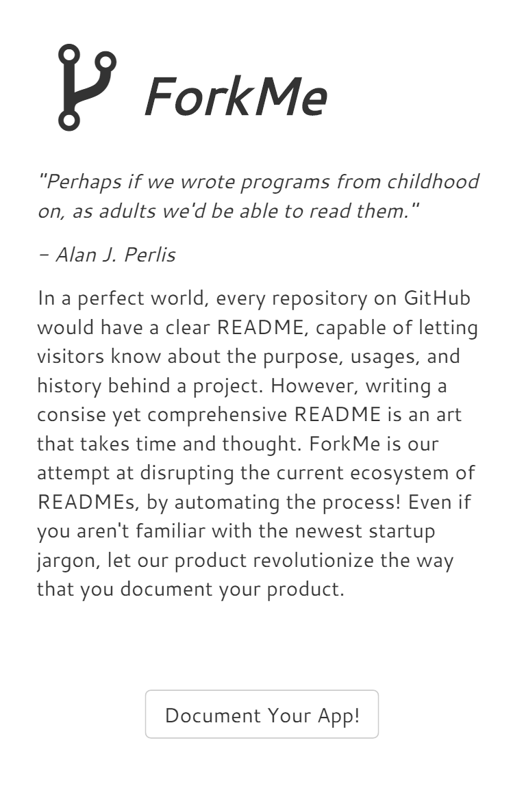

# [ForkMe](https://aliu139.github.io/forkme/)
by [Austin Liu](https://github.com/aliu139) and [Jared Wong](https://github.com/techlover10)

> ''Perhaps if we wrote programs from childhood on, as adults we'd be able to read them.'' - Alan J. Perlis 

# Introduction
In a perfect world, every repository on GitHub would have a clear README, capable of letting visitors know about the purpose, usages, and history behind a project. However, writing a consise yet comprehensive README is an art that takes time and thought. ForkMe is our attempt at disrupting the current ecosystem of READMEs, by automating the process! Even if you aren't familiar with the newest startup jargon, let our product revolutionize the way that you document your product.

# How to Run
Just open it up in a browser, and click through the expeience!
* If you want to add custom text, click on the wrench and type in your desired text
* If you want to let us do the magic for you, just click on the wand!

# Built With
* [VueJS](https://vuejs.org/)
* [Bootstrap](http://getbootstrap.com/)
* [Python](https://www.python.org/)
* * [NLTK](http://www.nltk.org/)
* Data from various READMEs on GitHub
* [LoremFlickr](http://loremflickr.com/)

# Inspired By
Jared Wong's original [Pitbull Generator](https://github.com/techlover10/PitbullGenerator)
